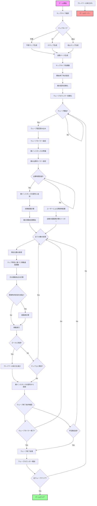

この更新されたフローチャートは、マップタイプを考慮に入れた以下の主要なプロセスと考慮事項を表しています：

1. **マップ生成と初期化**:
   - プレイヤーがマップタイプ（平原、川、岩山）を選択します。
   - 選択されたタイプに基づいて迷路ベースのマップを生成します。
   - マップタイプ別の調整を行います（例：平原は通路を増やす、川は水路と橋を追加、岩山は通路を減らす）。
   - 開始地点と終了地点を設定します。

2. **ゲーム初期化**:
   - 敵を格納するための配列を初期化します。
   - ウェーブカウンターを初期化します。

3. **ウェーブ管理**:
   - ウェーブ開始時に、そのウェーブの設定を読み込みます。
   - ウェーブタイマーを設定します。

4. **敵の生成と管理**:
   - 各敵に対して出撃時間を設定し、時間に達したら敵のインスタンスを生成し配列に追加します。
   - 初期経路を計算します。

5. **敵の移動処理**:
   - マップの特性に基づいて移動速度を調整します（例：森林では遅くなる、平地では通常速度）。
   - 障害物や地形変化を検出し、必要に応じて経路を再計算します。

6. **ゴール到達処理**:
   - 敵がゴールに到達した場合、プレイヤーの体力を減少させます。
   - その後、敵のインスタンスを配列から削除します。

7. **ウェーブ終了条件チェック**:
   - ウェーブタイマーが終了したか、または予定されていた全ての敵が倒されたかをチェックします。
   - いずれかの条件が満たされた場合、ウェーブ終了処理に移ります。

8. **ウェーブ終了処理**:
   - ウェーブカウンターを増加させます。
   - 全てのウェーブをクリアしたかチェックし、クリアしていない場合は次のウェーブを開始します。

9. **ゲーム終了条件**:
   - 全ウェーブクリアでゲームクリア。
   - プレイヤーの体力が0になった場合、ゲームオーバー。

このデザインの特徴と利点：

- 異なるマップタイプにより、プレイヤーに多様な戦略的選択肢を提供します。
- マップの特性が敵の移動に影響を与え、より動的で興味深いゲームプレイを実現します。
- ウェーブ制御により、ゲームの難易度を段階的に上げることが可能になります。
- 時間制限と敵の全滅という2つのウェーブ終了条件により、プレイヤーに異なる目標を提供します。

実装時の注意点：

- 各マップタイプの特性をバランス良く設計し、それぞれに独自の戦略が必要になるようにします。
- マップの視覚的表現を工夫し、プレイヤーが直感的に地形の特性を理解できるようにします。
- パフォーマンスに注意を払い、特に複雑なマップや多数の敵が存在する場合の処理を最適化します。
- ユーザーインターフェースで現在のウェーブ情報、残り時間、マップ特性などを明確に表示します。

この設計により、マップタイプの違いを活かした、より戦略的で多様なゲームプレイ体験を提供することができます。
